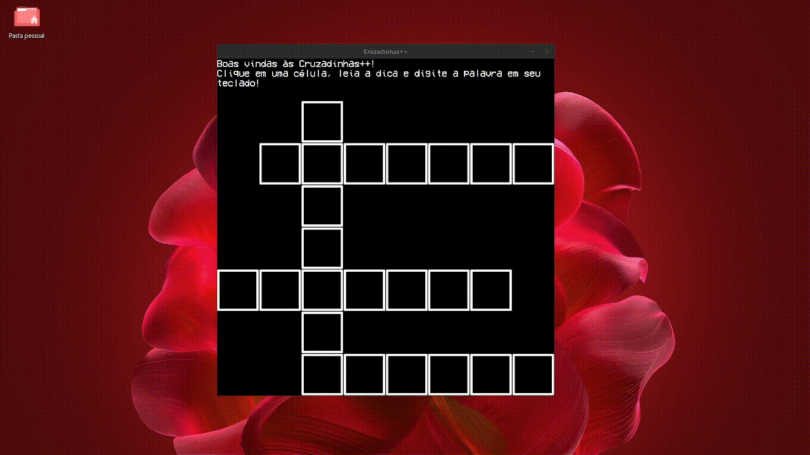

# Cruzadinhas++


Jogo de palavras cruzadas feito em C++



---

## :file_folder: Acesso ao projeto

Você pode clonar esse repositório com o comando a seguir:

```bash
git clone https://github.com/FabioAdrianoSilveira/cpp-crosswords
```

---

## :open_file_folder: Abrir e rodar o projeto

### Pré-requisitos

* MySQL Server com bibliotecas para conexão em C++
* Sistema operacional Linux ou WSL no Windows 11

### Setup

Para preparar o projeto para execução, siga o passo a passo:
* Passe o conteúdo de **palavras_cruzadas.sql** para sua instância do MySQL.


* Caso esteja usando um servidor MySQL externo ou sua porta de conexão do MySQL seja diferente da padrão, edite a porta de conexão na linha 175 do arquivo main.cpp na pasta server.


* Edite o arquivo main.cpp na pasta server da linha 423 até a linha 426 de acordo com a sua configuração do MySQL.

### Iniciar o projeto

Uma vez que o setup tenha sido feito, rode o comando a seguir na raiz do projeto
```bash
g++ main.cpp -o main && ./main
```
Caso encontre algum erro durante a execução do projeto, copie o log do erro e use um agente de IA como [ChatGTP](https://chatgpt.com/) ou [Gemini](https://gemini.google.com/) para ajudar a resolver.

---

## :hammer_and_pick: Ferramentas e tecnologias

* Linguagem de programação: C++
* Framework: Simple DirectMedia Layer (SDL)
* Banco de dados: MySQL

---

## :bust_in_silhouette: Autores do projeto

[](https://github.com/FabioAdrianoSilveira)
[](https://github.com/harperbolic)

---

## Licença

Este projeto está sob a licença MIT, para mais informações, leia o arquivo [LICENSE](LICENSE)
